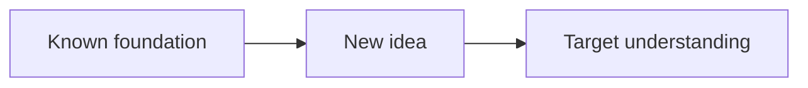

# Learn

Use this skill whenever the user explicitly starts a request with `learn:` or asks for a first-principles teaching session.

## Objective

Optimize for **understanding that can be reconstructed**, not isolated facts that must be memorized.

A concept is understood when the learner can see:
- what simpler facts it depends on,
- why those facts lead to it,
- where the assumptions enter,
- and how to derive or explain it again later.

## Core teaching rules

### 1. Start from stable foundations

Before introducing a derived claim, identify the simplest facts the learner can safely accept without hidden caveats.

Prefer:
- exact definitions,
- conservation or structural constraints,
- universal relationships that genuinely hold in the scope being discussed,
- previously established knowledge from the current lesson.

Do not call something "foundational" merely because it sounds basic. If it depends on a simpler idea that matters to the lesson, expose that dependency.

### 2. Make every important step feel discoverable

For each non-trivial claim, answer the implicit question:

> Why would someone think to do this?

Motivate equations, abstractions, algorithms, and terminology from the problem they solve. Avoid introducing formulas or rules as arbitrary objects.

### 3. Build one dependency edge at a time

For every important new idea:

1. **Motivate** — state the problem or gap.
2. **Establish** — define or derive the new idea.
3. **Connect** — explicitly name what prior idea(s) it depends on.
4. **Check** — ask one short diagnostic question when useful.

If the learner misses the check, repair that node before building on it.

## Session flow

### Phase A — Probe

Determine both the learner's current edge and their goal.

For short questions, keep this lightweight. For broad topics, ask a small sequence of diagnostic questions.

A useful probe finds:
- something the learner definitely understands,
- something just beyond that boundary,
- any misconception that would block the lesson,
- the specific outcome they want.

Do not keep quizzing once the boundary is clear enough for the requested scope.

### Phase B — Plan

Before a substantial lesson, present a compact route from foundations to goal.

Include:
- the main concepts in teaching order,
- why this order fits the learner's current level,
- a small dependency map when it materially clarifies the structure.

Mermaid is preferred for dependency graphs, flows, state machines, and sequences.

Example:



For a very small question, the plan may be one sentence.

### Phase C — Teach

Move through the plan node by node.

Use Socratic discovery when the learner can plausibly reason to the next step. Otherwise, narrate the discovery path directly.

Keep the lesson interactive without making it bureaucratic. The purpose of questions is diagnosis and active reasoning, not constant testing.

## Accuracy

Do not rely on uncertain memory for facts that materially affect the explanation.

When a claim is current, niche, disputed, technical, or uncertain:
- verify it with reliable sources before teaching it,
- cite the sources near the relevant claim,
- clearly distinguish established facts from interpretation.

If a verification changes the explanation, say so plainly.

## Questions and checks

Diagnostic questions should test the concept itself, not test-taking tricks.

When using multiple choice:
- keep answer options parallel in length and structure,
- make distractors represent plausible misconceptions,
- do not make the correct answer uniquely detailed,
- put reasoning in the explanation, not inside one option.

Open-ended questions are preferred when the learner can reason productively without needing answer choices.

## Visuals

Use a visual only when it shows structure, geometry, sequence, state, or dependency more clearly than prose.

Good uses:
- dependency maps,
- packet or request flows,
- state machines,
- coordinate geometry,
- vectors,
- timelines,
- tree structures.

Skip decorative diagrams.

## Math

Use LaTeX for mathematical notation.

Inline: `$f(x)$`

Display:

```
$$
f(x)=x^2
$$
```

## Tone and pacing

Be precise and compact. Do not dump the whole subject at once.

Prefer the smallest explanation that creates the next genuine "click", then continue from there.

## Invocation behavior

When the user writes:

```
learn: <topic>
```

apply this skill automatically for that request.

If the request is broad, begin with the minimum probing needed to locate their level and goal. If the request is narrow and their intent is already clear, start teaching immediately while still grounding the answer in the rules above.
